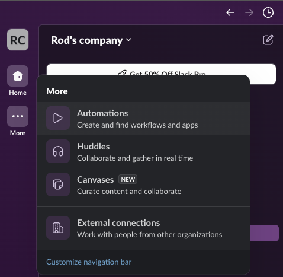
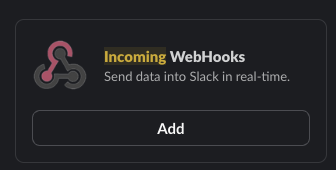
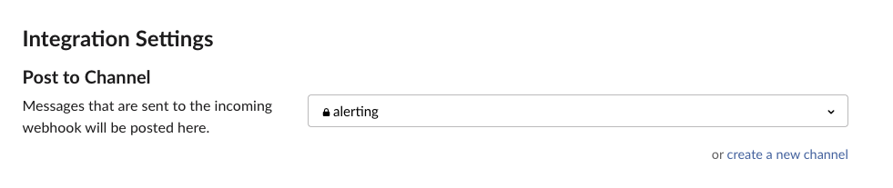
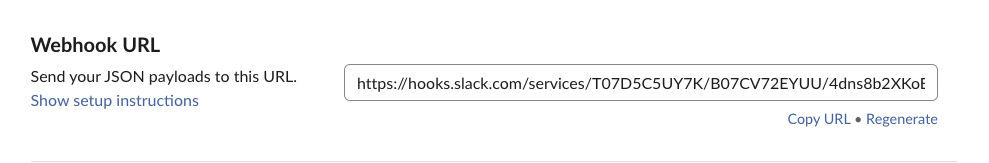

# Alerting Clients

This repository contains code for sending notifications when a specified number of clients per namespace is exceeded.

## Features

- Easy-to-setup Vault server directly deployed on your machine
- Grafana & Prometheus deployed as a docker container
- Customizable alert templates
- Integration with slack to received the notification.

## Installation

To install the alerting clients library, follow these steps:

1. Clone the repository: `git clone https://github.com/Rodi26/alerting_clients`
2. Navigate to the project directory: `cd alerting_clients`
3. If you need to install Vault Server
   1. launch the `./vault/00_initialise_vault.sh` script. The script assumes your license file is available in the directory `$home/licenses`
   2. start vault `./vault/11_start_vault.sh`. You will need to unseal vault manaually. 
4. set the following variables
   1. VAULT_ADDR
   2. VAULT_TOKEN
   3. slack_api_url (see #setup slack)

## Setup Slack
- 
- 
- 
- 
- export slack_api_url=`your url`

## Start the monitoring and alerting stack.
- simply execute `./telemetry/initialise.sh`
- The default number of clients is 2 (for testing purpose). You can modify this number by editing the file `./configuration/alert.rules`
